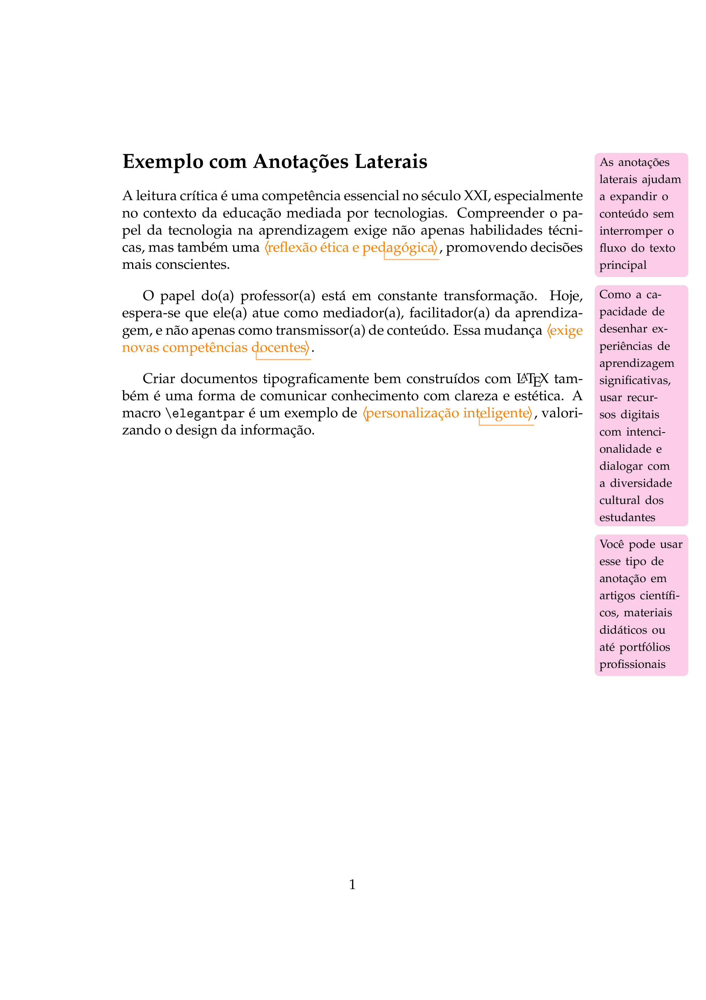
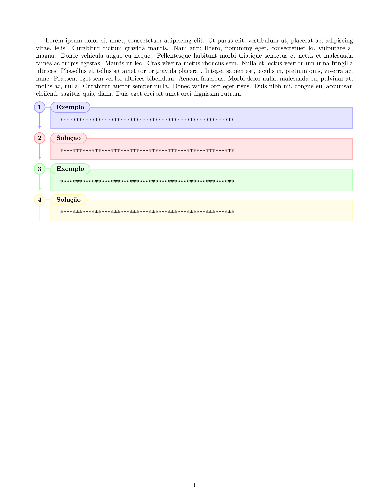

# Galeria de códigos LaTeX – Texto
| Visual | Código |
|--------|--------|
|  | [001_imagem.tex](001_imagem.tex) |
|--------|--------|
|  | [002_imagem.tex](002_imagem.tex) |
|  | [003_imagem.tex](003_imagem.tex) |

